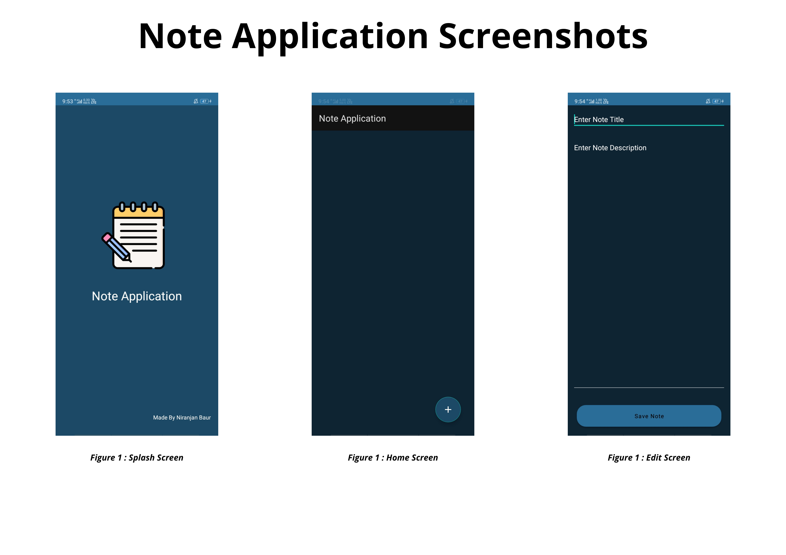

# Choose master branch to see the files of Note-Application's.
# Android-Study-Jam
## Note Application

### PROBLEM STATEMENT : 
I thinking about an app where I can save my learning progress. Then I realized that this is not only with me but with everyone. Technology plays a vital role in day-to-day life activities which in turn made great changes in many work fields and out of them Mobile Application is one of the major developments. Mobile Application can be used effectively for this job as they are widely used and are known for easy access.

### PROBLEM SOLUTION :
Note Application is an easy-to-use free notes app for Android, optimized for after-call note-taking. This clear and simple notebook app allows you to make quick notes, memos, and checklists to help organize your life with great ease.
Notepad features many high-quality features including the options to write, save and edit notes, write checklists, sort notes by title or by date, and save backups of important notes to your phone. A useful note-taking feature allows you to make notes immediately following every phone call made or received so that you don’t forget any important details.
The useful checklist function allows you to keep clear lists such as shopping lists or task lists but also allows you to cross out items on the list when they are completed, by deleting them.

### SOME SCREENSHOTS OF THE NOTE APP :    

                    
                

### FUNCTIONALITY AND CONCEPT USED : 

The App has a very simple and interactive interface which helps the peoples to save their notes in this app. Following are few android concepts used to achieve the functionalities in app: 

•	Simple & Easy Views Design : Use of familiar audience EditText with hints and interactive buttons made it easier for peoples to save their notes. Apps also uses App Navigation to switch between different screens.

•	RecyclerView : To present the list of different notes which is created by the user, we used the efficient recyclerview.

•	LiveData & Room Database : We are also using LiveData to update & observe any changes in the note at real time and update it to local databases using Room.

### APPLICATION LINK & FUTURE SCOPE :
The app is currently in the Alpha testing phase of the users, You can access the app: https://github.com/Niranjan-Baur/Note-Applicatipn/tree/master (GitHub Link).

